# NEUROFORGE² — Universal Brain-Data Platform

> BIDS-native · Extensible · Reproducible · Real-time capable
> A desktop-class neuro-engineering console for EEG/MEG/iEEG/fNIRS.
> **v0.1.0** · MIT licensed · FastAPI + MNE-Python backend · React/WebGL HUD · Python client

NeuroForge is a production-oriented platform for neuroengineers, BCI researchers and
cognitive scientists. The numerical core is **MNE-Python + SciPy + NumPy** behind a
**FastAPI** service; the interface is a **React + TypeScript + WebGL** "desktop
imperium" HUD.

This repository implements **all 10 spec modules at MVP depth — plus a Code Lab for
custom user scripts** — each wired end-to-end, GUI **and** API, computing on real
MNE-Python / SciPy / scikit-learn (every value on screen is a real computation, not a
mock). See [`docs/ROADMAP.md`](docs/ROADMAP.md) for the depth-hardening plan per module.

---

## What works today

| # | Module | Status | Notes |
|---|--------|--------|-------|
| 01 | Universal Loader / BIDS Repository | ✅ live | EDF/BDF/GDF/BrainVision/EEGLAB/FIFF/EGI via MNE; synthetic generator; BIDS subject/session tree; channel & event sidecars; in-memory index |
| 02 | Interactive Visualization | ✅ live | Multichannel viewer, Welch/multitaper PSD, 2D inferno topomap (real interpolation), 3D WebGL head, band-power matrix, real-time scroll |
| 03 | Preprocessing Pipeline | ✅ live | Visual pipeline builder (re-ref · filter · notch · resample · bad-channel detect · interpolate · ICA+EOG), before/after PSD QC, derivatives |
| 04 | ERP / ERF Analyzer | ✅ live | Event epoching, condition averages, GFP, peak picking, difference wave, **cluster-based permutation test**, difference topography |
| 05 | Signal Analyzer / Features | ✅ live | Hjorth, perm-entropy, Higuchi FD, DFA, spectral edge/median/peak; PLV/PLI/wPLI/coherence + connectogram + graph metrics; **aperiodic/periodic 1/f (specparam-style)**; **EEG microstates** (modified k-means — maps, coverage, duration, transitions) |
| 06 | Cross-Session Mapper | ✅ live | Cohort dashboard, datasets×channels band-power map, session-similarity matrix + reliability |
| 07 | Benchmarking Suite | ✅ live | Pipeline shootout on α-SNR + runtime, channel-correlation QC, environment capture + repro hash |
| 08 | BCI Workbench | ✅ live | **CSP / Riemannian** + LDA/SVM/RF, 5-fold CV, accuracy/κ/AUC/ITR, confusion, CSP topographies, sim real-time control |
| 09 | Data Editor / Annotation | ✅ live | Drop/rename channels, bipolar virtual channels, crop, annotations — non-destructive derivatives + provenance/version history |
| 10 | Reporting / Export | ✅ live | matplotlib HTML report (embedded PSD + topo), export FIF/CSV/NumPy/HDF5/EDF, reproducibility/env panel |
| 11 | Code Lab / Scripting | ✅ live | Run custom Python in an **isolated subprocess** (timeout, captured stdout + figures), save/reuse scripts; **run across many datasets (each / group)**, `nf.*` engine helpers, user/system error split; auth-gated |

Every value on screen is a **real computation** — the seeded datasets are physiologically
plausible synthetic EEG (posterior alpha, frontal eye-blinks, mains noise, oddball events)
generated by MNE, so the platform is usable with zero data on disk. Verified live:
the BCI decoder reaches **95% accuracy / κ 0.90 / AUC 0.98** on the alpha-state task.

> **MVP depth** means each module implements its headline capabilities end-to-end, not
> every sub-bullet of the spec. `docs/ROADMAP.md` lists the remaining depth per module
> (e.g. Autoreject/PREP for M3, Granger/DTF for M5, EEGNet + LSL real-time for M8).

---

## Screenshots

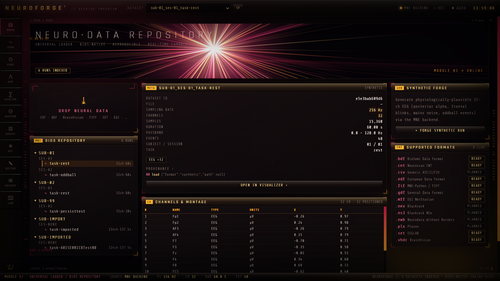
*Module 1 — Universal loader & BIDS repository: drag-and-drop import, subject/session tree, metadata and channel/montage tables.*

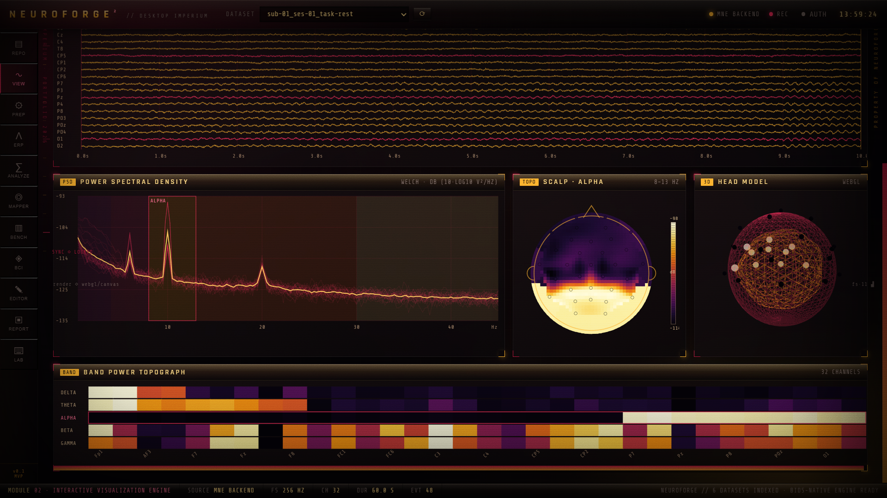
*Module 2 — Interactive visualization: multichannel viewer, Welch PSD, alpha scalp topomap, 3D head model and band-power matrix.*

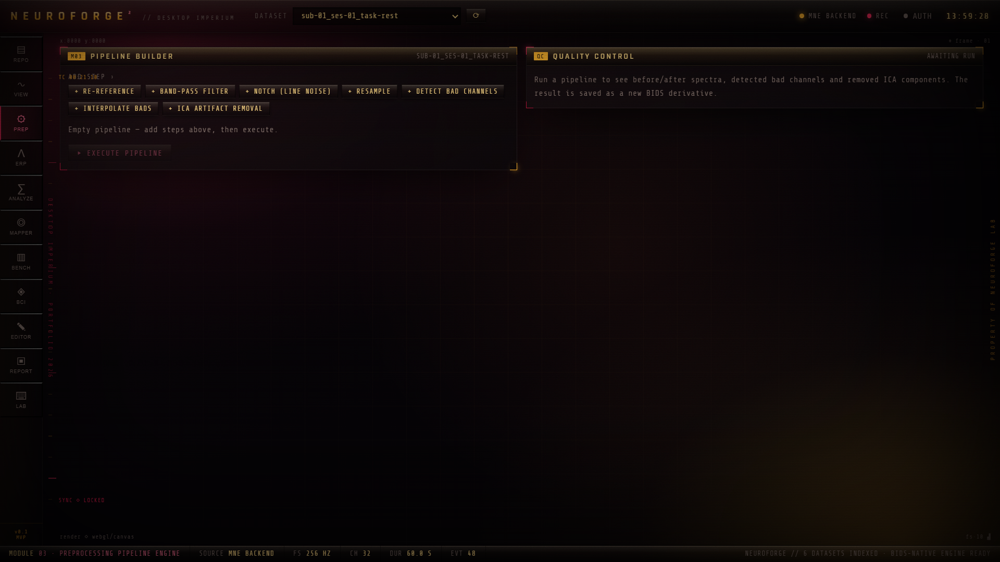
*Module 3 — Preprocessing: drag-to-build pipeline (re-reference, filter, notch, bad-channel detection, ICA) with before/after QC.*

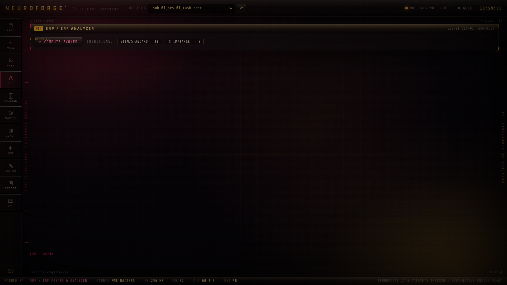
*Module 4 — ERP/ERF analyzer: event conditions, averaging, GFP, difference waves and spatio-temporal cluster statistics.*

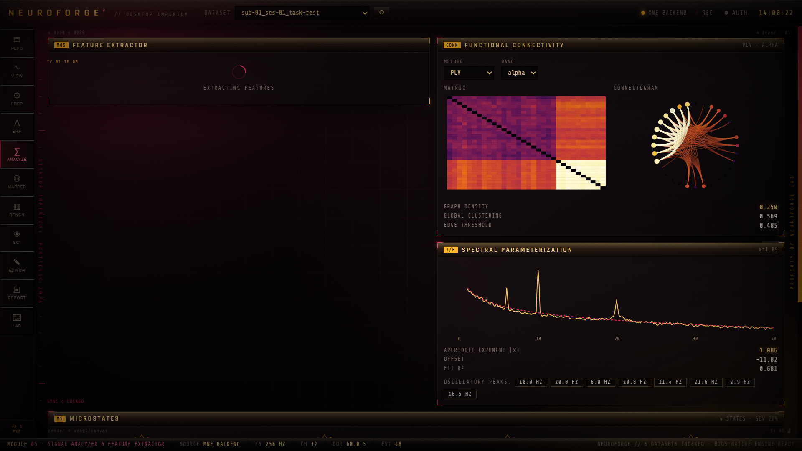
*Module 5 — Signal analyzer: per-channel features, PLV connectivity matrix + connectogram, 1/f spectral parameterization and microstates.*

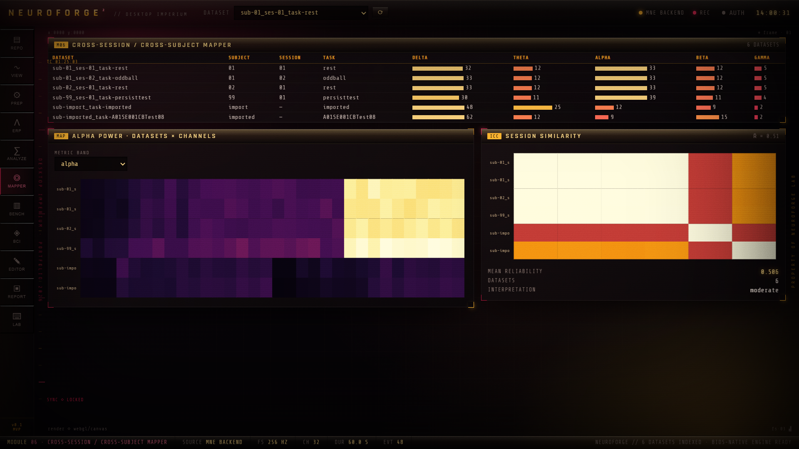
*Module 6 — Cross-session / cross-subject mapper: cohort band power, datasets×channels map and session-similarity matrix.*

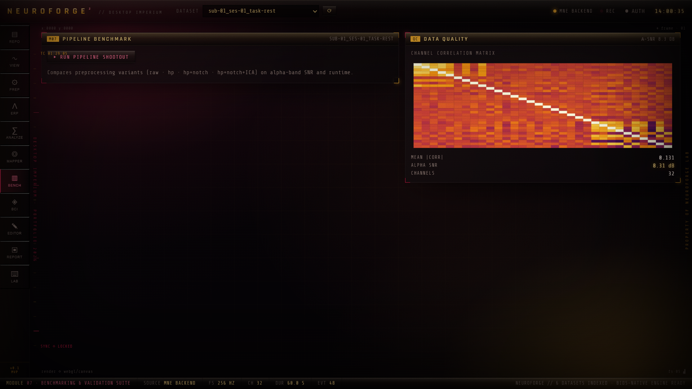
*Module 7 — Benchmarking & validation: preprocessing-pipeline shootout, channel-correlation data quality and reproducibility capture.*

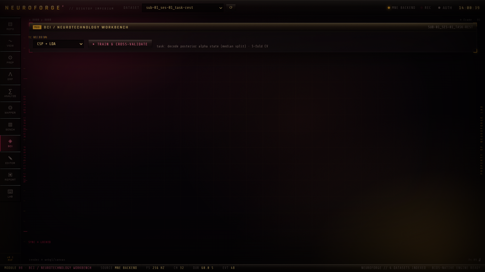
*Module 8 — BCI workbench: CSP / Riemannian decoders with cross-validated accuracy, κ, AUC, ITR and a confusion matrix.*

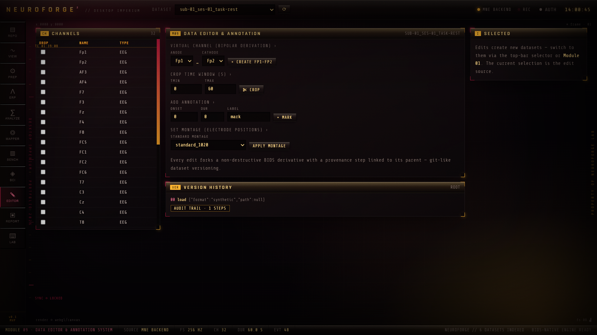
*Module 9 — Data editor & annotation: channel ops, bipolar virtual channels, crop, annotations, set-montage and version history.*

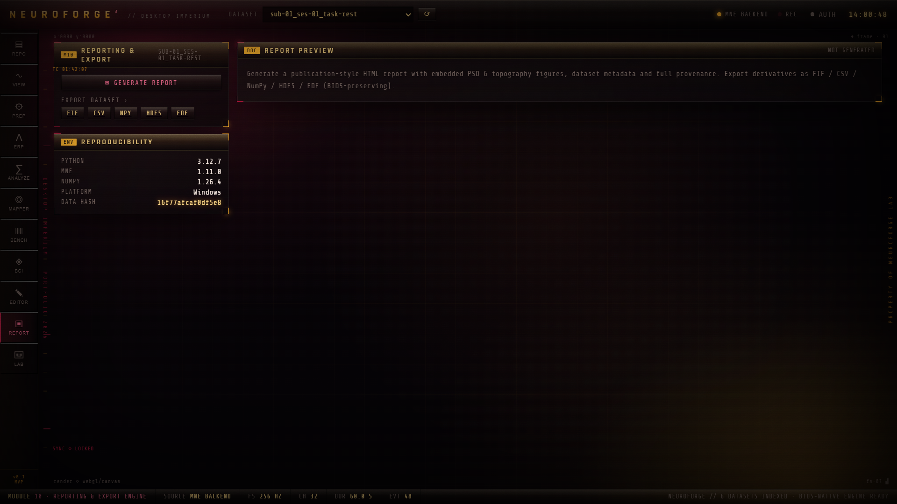
*Module 10 — Reporting & export: HTML report with figures, FIF/CSV/NumPy/HDF5/EDF export and environment/reproducibility capture.*

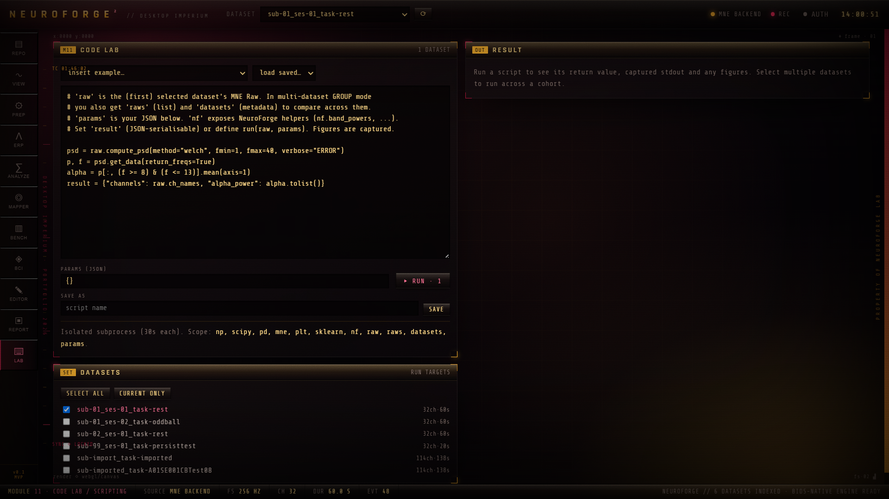
*Module 11 — Code Lab: run custom Python (`np/scipy/mne/nf`) across one or many datasets in an isolated subprocess.*

## Quickstart

Prerequisites: **Python 3.11+** (with `mne`, `fastapi`, `uvicorn`, `scipy`, `numpy`)
and **Node 18+**.

### 1 · Backend (FastAPI + MNE)

```bash
cd backend
pip install -r requirements.txt
python run.py
```

Backend runs at `http://127.0.0.1:8000` (API docs at `/docs`).

### 2 · Frontend (Vite + React)

```bash
cd frontend
npm install
npm run dev
```

> Windows `cmd`/PowerShell: paste commands **without** any trailing `# …` comment —
> `#` isn't a comment there, so Vite would treat it as the folder to serve and show a blank page.

The Vite dev server proxies `/api` → `:8000`, so just open **http://localhost:5173**.
If the backend is down, the UI falls back to a client-side synthetic engine so it
keeps working.

### 3 · Tests

```bash
cd backend
python -m pytest tests/ -q        # cores, persistence round-trip, API
```

### Use it from your own notebook

```python
from neuroforge_client import NeuroForge      # client/neuroforge_client.py (needs requests)
nf = NeuroForge("http://localhost:8000")
nf.upload("sub-01_task-rest.edf")             # real EEG auto-detected, named from the file
print(nf.aperiodic(nf.datasets()[0]["id"])["mean"])
```

See [`client/README.md`](client/README.md). Everything maps 1:1 to the REST API (`/docs`).

### Data & persistence

Loaded recordings are stored as FIF under `backend/data/raw/` and indexed in
`backend/data/neuroforge.db` (SQLite). Datasets, derivatives and edits **survive
restarts**; metadata is cached so the repository lists without reading the data.
Point `NEUROFORGE_DATA` at another directory to relocate the store.

### Docker (full stack)

```bash
docker compose up --build      # → http://localhost:8080  (frontend → /api → backend)
```

### Enabling auth

Off by default. To require tokens:

```bash
NEUROFORGE_AUTH=1 NEUROFORGE_TOKENS="secret:admin,team:analyst,guest:viewer" python run.py
```

Then set the token in the UI (top-bar **AUTH** button) or send `Authorization: Bearer <token>`.
Reads need `viewer`; preprocessing / decoding / edits need `analyst`.

---

## Architecture (MVP)

```
┌─────────────────────────────────────────────────────────────┐
│  React + TS + WebGL  (frontend/)                             │
│  Boot → Shell (rail · topbar · status) → Modules            │
│  Repository(M1)   Visualize(M2: signal·PSD·topo·3D·bands)   │
│         │  fetch /api/*  (auto-fallback to offline engine)   │
└─────────┼───────────────────────────────────────────────────┘
          ▼
┌─────────────────────────────────────────────────────────────┐
│  FastAPI  (backend/neuroforge/)                              │
│  api/datasets · api/signal · api/spectral                   │
│         │                                                    │
│  core/  NeuroData ─ loaders ─ synthetic ─ dsp ─ montage     │
│         registry (→ SQLite/Postgres target)                 │
│         │                                                    │
│  MNE-Python · SciPy · NumPy                                  │
└─────────────────────────────────────────────────────────────┘
```

The **`NeuroData`** object model (`backend/neuroforge/core/neurodata.py`) is the central type:
every format normalizes into it, preserving sampling rate, channel types/locations,
montage, BIDS entities, events and a **provenance log**. See
[`docs/ARCHITECTURE.md`](docs/ARCHITECTURE.md).

### Key API endpoints (full OpenAPI at `/docs`)

```
GET  /api/health
GET  /api/datasets            · /tree · /formats · /{id} · /{id}/channels · /{id}/events
POST /api/datasets/synthetic  · /upload
GET  /api/signal/{id}/window?start&duration&picks&max_points
GET  /api/spectral/{id}/psd        ?fmin&fmax&method
GET  /api/spectral/{id}/bandpower  ?relative
GET  /api/spectral/{id}/topomap    ?fmin&fmax&resolution
```

---

## Design language — "Desktop Imperium"

The HUD blends two turn-of-the-millennium digital-art references (ZX03 / Jens Karlsson):
a **crimson shard-burst** over black and a **golden coil**. Concretely:

- cinematic crimson→gold color grade over deep black, two atmospheric light sources
- a generative **shard-burst hero** render (canvas, additive glow + vanishing-point floor)
- **brushed-metal beveled chrome** title bars, buttons and status furniture
- **inferno/magma** data palette (black→violet→crimson→orange→gold→pale) for all heat maps
- engineered margin annotations: timecodes, rulers, registration marks, version strings
- film grain + scanlines + vignette for depth

All theming lives in `frontend/src/styles/tokens.css` (a single source of truth).

---

## Production readiness

Honest status — this is a solid, real foundation, not yet a finished product.

**In place now**
- Durable storage (SQLite index + on-disk FIF) with lazy loading; survives restarts.
- **Bounded memory** — an LRU cache keeps only N recordings' samples in RAM (the rest
  reload from FIF on demand); batch jobs free memory between datasets.
- **Real-data aware** — auto-detects the real EEG among mixed channels (e.g. a 114-ch
  BigP3BCI EDF → 32 EEG, the rest typed stim/misc) and draws topographies from the
  recording's *own* electrode positions, not a fixed layout.
- **Python client SDK** ([`client/`](client/README.md)) — drive everything from your own notebooks.
- **Background job queue** — ICA/decoding/benchmarks/scripts run async with status polling
  (`/api/jobs`); requests don't block.
- **Auth + RBAC** — bearer-token + viewer/analyst/admin roles, env-gated
  (`NEUROFORGE_AUTH` / `NEUROFORGE_TOKENS`); off by default for dev.
- **User scripting (Code Lab)** — run custom Python against a dataset in an isolated
  subprocess (timeout + POSIX memory cap, captured stdout/figures), save/reuse scripts;
  analyst-gated, disable with `NEUROFORGE_SCRIPTS=0`.
- **Observability** — structured logging, per-request IDs + timing, global error envelope.
- Provenance on every transform; reproducibility (data checksum + environment capture).
- Non-destructive, versioned derivatives (edits/preprocessing fork new datasets).
- Input hardening — upload size limit, data-integrity checks on import, graceful degradation.
- Automated tests (cores, persistence, jobs, auth, API) via pytest; **Docker + compose + CI**.

**Required before real-world / clinical use** (prioritized)
1. **Scale-out** — swap the in-process queue for Celery/RQ + Redis; memory-mapped /
   chunked reads for 10 GB+ recordings; streaming (not buffered) upload; WebSocket progress.
2. **Security & compliance** — full user management / OAuth, encryption at rest,
   de-identification, persisted audit log; PHI handling for HIPAA/GDPR. *Don't put patient
   data in this yet.* **Scripting** is subprocess-isolated for *trusted* users — untrusted
   multi-tenant use needs a container/gVisor sandbox + cross-OS resource quotas.
3. **True BIDS** — `mne-bids` read/write, `bids-validator`, on-disk derivatives layout.
4. **Rigor** — ICLabel for ICA component classification (currently an EOG-proxy heuristic),
   Autoreject/PREP, TFCE / full spatiotemporal cluster correction, FDR.
5. **Modalities** — MEG (SSP/Maxwell), iEEG/sEEG montages, fNIRS; arbitrary montages.
6. **BCI depth** — real LSL hardware loop (<50 ms), online adaptive classifiers,
   EEGNet/deep models, FBCSP, cross-session transfer.
7. **Ops** — Alembic migrations + Postgres option, backups, telemetry, Tauri desktop
   packaging with the API as a sidecar.
8. **Workflow** — undo/redo, batch processing across subjects, large-file WebGL viewer,
   plugin API, hardened REST docs.

See [`docs/ROADMAP.md`](docs/ROADMAP.md) for the per-module depth plan.

## Repository layout

```
backend/   FastAPI + MNE engine (NeuroData, loaders, dsp, montage, api)
frontend/  Vite + React + TS HUD (components, modules, styles, api client)
docs/      ARCHITECTURE.md · ROADMAP.md
```
